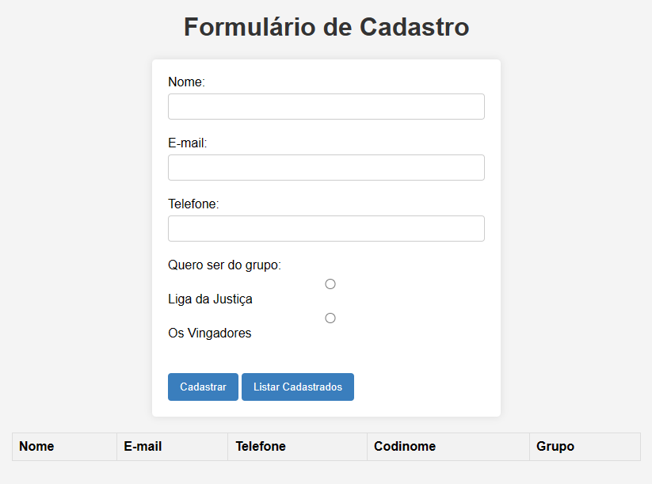
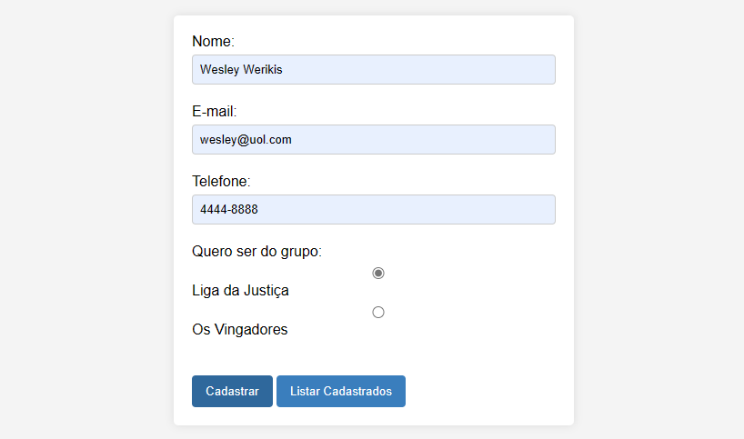
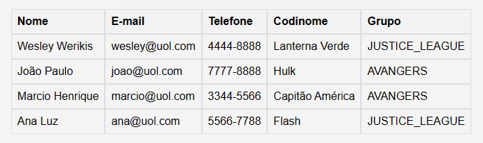

  <h1 style="border-bottom:none">UOL HOST - (SpringBoot) 👨‍💻</h1> 
  
   
Este projeto é do UOL HOST, um desafio open source. O Rafael Kiss Dev fez um vídeo compartilhando insights e a solução. Consegui concluir o projeto, aprofundando meus conhecimentos sobre o Spring, suas facilidades e validações. Através desse projeto do UOL HOST, adquiri novos conhecimentos e habilidades

- Acesse o vídeo do Rafal Kiss (Desafio BACKEND da UOL com Java SpringBoot!) [clicando aqui](https://www.youtube.com/watch?v=uAge5qlxElI&t=604s).

- Link do repositório do teste open source (test-backEnd-Java UOL HOST) [clique aqui](https://github.com/uolhost/test-backEnd-Java).

<h4>Tópicos abordados:</h4>
  
   + Criação de API em Spring Boot contendo os métodos: GET e POST;
   + Validação de informações utilizando o Bean Validation.
   + Criação de Services para injeção de Object a patir de um DTO.
   + Criação de uma estrutura front-end em HTML/CSS & JavaScript para consumir a API.

<h2>Telas do Projeto: </h2>

+ Página inicial

  <h4 style="border-bottom:none">SOBRE OS GRUPOS (Liga da Justiça & Os Vingadores)</h4> 

  
+ INSTRUÇÕES CONTIDAS NO REPOSITÓRIO (UOL HOST):

   

   Permitir o cadastro de jogadores de acordo com os codinomes contidos nos links de referência vingadores.json e liga_da_justica.xml.

   Impedir a utilização de um mesmo codinome para diferentes usuários (a menos que o codinome seja para listas diferentes).
   
   Incluir o codinome escolhido dentro das listas Os Vingadores ou A Liga da Justiça.
   
   Obrigatoriamente, ler a informação do codinome em arquivos na internet (links abaixo).
  
  https://raw.githubusercontent.com/uolhost/test-backEnd-Java/master/referencias/liga_da_justica.xml 
  
  https://raw.githubusercontent.com/uolhost/test-backEnd-Java/master/referencias/vingadores.json

   

+ Cadastrar

+ Listar Cadastrados

<h2>Tecnologias utilizadas 💻</h2>

- ``Java, SpringBoot``
- ``HTML, CSS & JavaScript``
- ``H2 Database``

<h2></h2>

